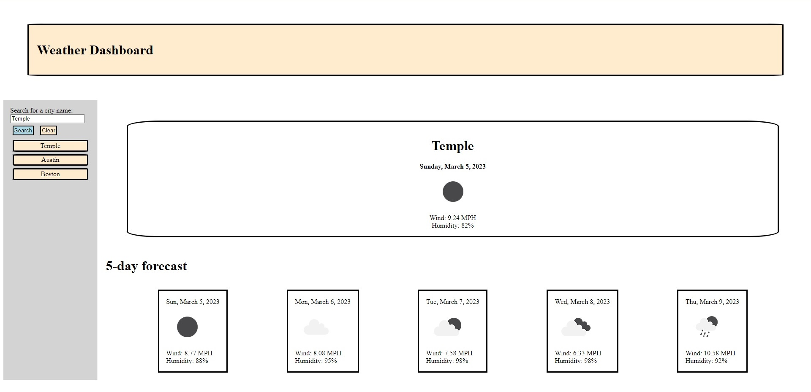

    

# Weather Forecast

## Table of Contents 

* [Description](#Description)
* [Usage](#Usage)

## Description

This application is a current and five day weather forecasting application that also saves the city history so you can go back to view a different city you've viewed previously without having to type the city into the search bar again.

Results are up to date when clicking "Search" or a previously searched city's name from the list.

## Usage

1. Navigate to [the application](https://bravenbright.github.io/weather-app/) or pull this repository and open `index.html` in your default browser.
1. Type the name of a US city into the search bar on the left side.
1. Click the "Search" button to display results.

The 10 most recently searched city names are cached to local storage. Clicking a previously searched city pulls up the current results for that city.

Clicking the "Clear" button removes past cities.

## Author

* Brigita Biederman
   * [Portfolio](https://bravenbright.github.io/Brigita-Bryant/)
   * [github](https://github.com/bravenbright)
   * [bbryantcs@gmail.com](mailto:bbryantcs@gmail.com)